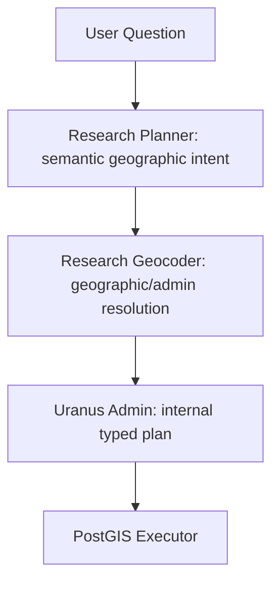

# Administrative resolution

## Responsibilities

This capability diagram shows responsibility, not network routing. Admin calls the
Planner, normalizes its wire plan, calls the Geocoder from its resolver, validates
results and supplies resolved boundaries to the Executor. The Planner never calls
geographic tools. The Executor never calls Nominatim.

## Audit and API change

The previous gateway requested `format=geocodejson` for search, lookup and reverse.
It exposed OSM identity, display label, address, centroid and bounding box. OSM
classification, administrative levels, extra tags, name details and polygons were
not exposed. A `district` in GeocodeJSON was an address component, not a proven
county-level administrative role.

All three operations now request JSONv2 plus `addressdetails=1, extratags=1` in a
single upstream request. JSONv2 supplies `category` (the old JSON `class`), `type`,
`addresstype`, `address` and `extratags`. No unfiltered upstream dictionaries,
`namedetails`, Nominatim `place_id`, website tags or provider errors are forwarded.
Existing public address and south/west/north/east bbox conventions remain intact.

Each result exposes:

- `name`: canonical provider name, separate from the full display address;
- `administrative_level`: municipality, district, state, country, region or unknown;
- `administrative_levels`: the evidenced roles of the object;
- `country_code`: lowercase two-letter code when supplied;
- `official_code` and `official_code_type`: unchanged value and source tag;
- `osm_type` and `osm_id`: the stable provider reference pair;
- `boundary`: only when explicitly requested from lookup.

Nullable absent values continue to be omitted by the existing HTTP serialization;
the typed value of a missing official code is `null`. This is never an error.
Consumers with closed old response models must be upgraded to accept these fields
before enabling this release. Admin's client validates the new private projection
and preserves its legacy browser-facing Place projection.

## Metadata rules

`administrative.py` owns country-aware classification. No place-name lookup table
or substring classifier is used. For Germany, an administrative boundary's explicit
OSM level maps 2 → country, 4 → state, 6 → district and 8 → municipality. Other
explicit levels remain unknown. Without that numeric tag, a boundary/place may use
its supported Nominatim address/place classification. A road with a state address
is never classified as the state itself.

A full eight-digit supplied AGS on a level-6 administrative boundary provides the
additional municipality role for an independent city. Its primary role is then
municipality and its district role remains available. At level 4, a full AGS adds
the municipality role while retaining primary state. Requested levels never change
this metadata. Missing evidence never creates a second role. Synthetic tests cover
Schleswig-Holstein, Schleswig-Flensburg, Flensburg and Germany; they are not live
provider probes or claims about a particular current OSM record.

`de:amtlicher_gemeindeschluessel` is preferred over `de:regionalschluessel`. Only
supplied ASCII decimal codes of supported lengths are copied, including shortened
state/district keys. No key is padded, truncated or derived from another key.
Leading zeros and the source-tag namespace survive. If both are present the
preferred code is returned; the response is not a full tag archive.

Other countries have no implicit numeric-level equivalence. Explicit country/region
place objects can be classified; unmapped administrative boundaries remain unknown.
Danish country-specific classification is a future adapter with its own fixtures.

## Boundary and ambiguity handling

`POST /search {"query":"Schleswig", "limit":5}` returns up to five candidates and
never declares the first one authoritative. Expected level, country/hierarchy and
canonical-name disambiguation belong to Admin. The gateway does not accept an
`area_level` hint that could overwrite an observed role.

`POST /lookup {"osm_type":"R", "osm_id":123, "include_boundary":true}` requests
`polygon_geojson=1`. Without the flag no polygon is requested. There is no arbitrary
provider URL, geometry simplification parameter or caller-selected response limit.
Normal replies remain limited to 256 KiB; explicit boundary replies to 8 MiB.
Polygon/MultiPolygon shape, coordinates and closed rings are validated; Admin's
PostGIS execution additionally verifies topology and non-emptiness. A centroid or
bbox is never substituted for a missing polygon. Oversized/invalid replies fail
safely. This can require a separately provisioned boundary source for large areas;
raising limits or simplifying boundaries is not automatic.

Authentication, fixed loopback upstream, verified TLS hostname, concurrency and
body/deadline limits, no redirects/retries/cookies and no body logging are unchanged.

## Verification and sources

All normal tests use MockTransport or a local TLS test server. No live Nominatim
probe was run for this change. Run the existing CI commands from the repository:
`uv run pytest -q`, `uv run ruff check .`, `uv run ruff format --check .`,
`uv run mypy`, and `git diff --check`.

Mapping/adapter references:
[Nominatim output formats](https://nominatim.org/release-docs/latest/api/Output/),
[Nominatim lookup](https://nominatim.org/release-docs/latest/api/Lookup/),
[German administrative boundaries](https://wiki.openstreetmap.org/wiki/DE%3AGrenze),
[German level 6](https://wiki.openstreetmap.org/wiki/DE%3ATag%3Aadmin_level%3D6),
[official municipality keys](https://wiki.openstreetmap.org/wiki/DE%3AKey%3Ade%3Aamtlicher_gemeindeschluessel),
[regional keys](https://wiki.openstreetmap.org/wiki/DE%3AKey%3Ade%3Aregionalschluessel).
